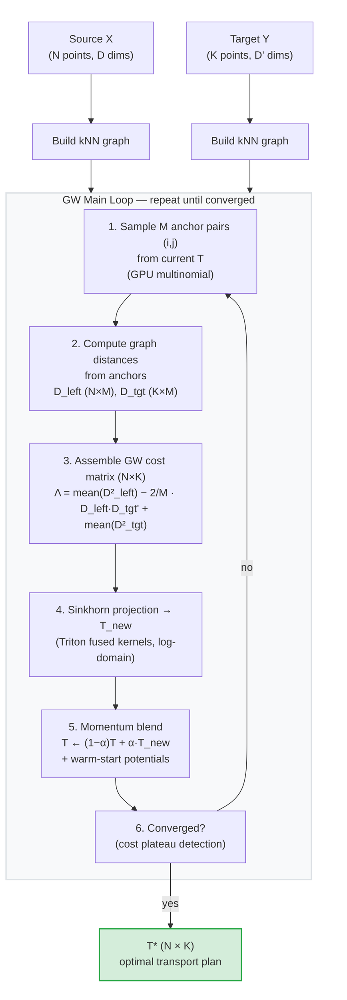

<p align="center">
  
</p>

<h3 align="center">Fast Sampled Gromov-Wasserstein Optimal Transport</h3>

<p align="center">
  <a href="https://chansigit.github.io/torchgw/"></a>
  <a href="https://github.com/chansigit/torchgw"></a>
  <a href="CHANGELOG.md"></a>
  <a href="LICENSE"></a>
  <a href="https://www.python.org/downloads/"></a>
  <a href="https://pytorch.org/"></a>
</p>

<p align="center">
  <b>Pure PyTorch</b> &nbsp;|&nbsp; <b>Triton GPU Kernels</b> &nbsp;|&nbsp; <b>Differentiable</b> &nbsp;|&nbsp; <b>Up to 175x faster than POT</b>
</p>

---

TorchGW aligns two point clouds by matching their internal distance structures --
even when they live in **different dimensions**. Instead of the full *O(NK(N+K))* GW cost,
it samples *M* anchor pairs each iteration and approximates the cost in *O(NKM)*,
enabling GPU-accelerated alignment at scales where standard solvers are impractical.

**Use cases:** single-cell multi-omics integration, cross-domain graph matching,
shape correspondence, manifold alignment.

## Highlights

<table>
<tr>
<td width="50%">

**Performance**
- Up to 175x faster than [POT](https://pythonot.github.io/) on typical workloads
- Triton fused Sinkhorn -- single-pass logsumexp, zero N*K intermediates
- Mixed precision: float32 Sinkhorn + float64 output
- Smart early stopping via cost plateau detection

</td>
<td width="50%">

**Features**
- Pure GW, Fused GW, and semi-relaxed transport
- Three distance modes: precomputed, Dijkstra, landmark
- Differentiable transport plans (autograd support)
- Low-rank Sinkhorn for N, K > 50k
- Multi-scale coarse-to-fine warm start

</td>
</tr>
</table>

## News

> **v0.4.1** (2026-04-09)  --  **Exact differentiable gradients** via implicit differentiation.
> The previous "envelope theorem" backward was a frozen-potentials approximation with up to
> 30x gradient error; now replaced by an adjoint system solved via Schur complement on the
> Sinkhorn Jacobian. New `grad_mode` parameter (`"implicit"` default, `"unrolled"` alternative).
> See [algorithm docs](https://chansigit.github.io/torchgw/algorithm.html) for the math.
>
> **v0.4.0** (2026-04-07)  --  Triton fused Sinkhorn (2-5x GPU speedup), mixed precision,
> smart early stopping, Sinkhorn warm-start, Dijkstra caching, and 15 numerical stability fixes.
> See [CHANGELOG.md](CHANGELOG.md).

---

## Installation

```bash
pip install -e .
```

**Requirements:** `numpy`, `scipy`, `scikit-learn`, `torch>=2.0`, `joblib`.
Triton ships with PyTorch and enables GPU kernel fusion automatically. No POT needed.

## Quick Start

```python
from torchgw import sampled_gw

# Basic usage
T = sampled_gw(X_source, X_target)

# Recommended for large-scale (fastest)
T = sampled_gw(X_source, X_target, distance_mode="landmark", mixed_precision=True)
```

<details>
<summary><b>Minimal working example</b> (click to expand)</summary>

```python
import torch
from torchgw import sampled_gw

X = torch.randn(500, 3)   # source: 500 points in 3D
Y = torch.randn(600, 5)   # target: 600 points in 5D (dimensions may differ)

T = sampled_gw(X, Y, epsilon=0.005, M=80, max_iter=200)
# T is a (500, 600) transport plan: T[i,j] = coupling weight between X[i] and Y[j]
print(f"Transport plan: {T.shape}, total mass: {T.sum():.4f}")
```

</details>

## Benchmark

Spiral (2D) to Swiss roll (3D) alignment, `mixed_precision=True`, landmark distances:

**NVIDIA H100 80GB HBM3:**

| Scale | Time | Spearman rho | GPU Memory |
|:------|-----:|:------------:|-----------:|
| 4,000 x 5,000 | **0.8 s** | 0.999 | 0.7 GB |
| 10,000 x 12,000 | **4.1 s** | 0.999 | 3.9 GB |
| 20,000 x 25,000 | **4.6 s** | 0.999 | 16 GB |
| 30,000 x 35,000 | **9.3 s** | 0.999 | 34 GB |
| 40,000 x 50,000 | **17 s** | 0.999 | 64 GB |
| 45,000 x 45,000 | **18 s** | 0.999 | 65 GB |

<details>
<summary><b>NVIDIA L40S 48GB</b></summary>

| Scale | Time | Spearman rho | GPU Memory |
|:------|-----:|:------------:|-----------:|
| 4,000 x 5,000 | **2.4 s** | 0.999 | 1.1 GB |
| 10,000 x 12,000 | **3.0 s** | 0.999 | 6.7 GB |
| 20,000 x 25,000 | **12 s** | 0.999 | 18 GB |
| 30,000 x 35,000 | **25 s** | 0.999 | 34 GB |
| 35,000 x 40,000 | **34 s** | 0.999 | 45 GB |

</details>

> Alignment quality (Spearman >= 0.999) is maintained across all scales.
> At 4000x5000, TorchGW is **~175x faster** than POT (1.0s vs 183s).
> Max scale is bounded by GPU memory for the N*K transport plan (~80% VRAM utilization).

<details>
<summary>Reproduce</summary>

```bash
python examples/benchmark_scale.py
```

</details>

<details>
<summary>Benchmark plots</summary>

| 400 vs 500 | 4000 vs 5000 |
|:---:|:---:|
|  |  |

</details>

---

## Distance Modes

Choose based on your data scale:

| Mode | Best for | Per-iteration | Memory | Notes |
|:-----|:--------:|:-------------:|:------:|:------|
| `"precomputed"` | N < 5k | O(NM) lookup | O(N^2) | All-pairs Dijkstra upfront |
| `"dijkstra"` | 5k-50k | O(MN log N) | O(NM) | On-the-fly with caching |
| **`"landmark"`** | **any scale** | O(NMd) GPU | O(Nd) | **Recommended default** |

```python
# Small scale: precompute all distances once
T = sampled_gw(X, Y, distance_mode="precomputed")

# Bring your own distance matrices
T = sampled_gw(dist_source=D_X, dist_target=D_Y, distance_mode="precomputed")

# Large scale (recommended)
T = sampled_gw(X, Y, distance_mode="landmark", n_landmarks=50)
```

---

## Usage Guide

<details>
<summary><b>Best performance settings</b></summary>

```python
T = sampled_gw(
    X, Y,
    distance_mode="landmark",   # avoids expensive all-pairs Dijkstra
    mixed_precision=True,       # float32 Sinkhorn (2x faster on GPU)
    M=80,                       # more samples = better cost estimate
    epsilon=0.005,              # moderate regularization
)
```

</details>

<details>
<summary><b>Fused Gromov-Wasserstein</b></summary>

Blend structural (graph distance) and feature (linear) costs:

```python
C_feat = torch.cdist(features_src, features_tgt)
T = sampled_gw(X, Y, fgw_alpha=0.5, C_linear=C_feat)

# Pure Wasserstein (no graph distances needed)
T = sampled_gw(fgw_alpha=1.0, C_linear=C_feat)
```

</details>

<details>
<summary><b>Semi-relaxed transport</b></summary>

For unbalanced datasets (e.g., cell types present in one sample but not the other):

```python
T = sampled_gw(X, Y, semi_relaxed=True, rho=1.0)
# Source marginal enforced, target marginal relaxed via KL penalty
```

</details>

<details>
<summary><b>Multi-scale warm start</b></summary>

Speeds up convergence by solving a coarse problem first:

```python
T = sampled_gw(X, Y, multiscale=True, n_coarse=200)
```

> Note: GW has symmetric local optima. Works best on data without strong symmetries.

</details>

<details>
<summary><b>Differentiable mode</b></summary>

Use GW transport as a differentiable layer (exact gradients via implicit differentiation):

```python
C_feat = torch.cdist(encoder(X), encoder(Y))
T = sampled_gw(fgw_alpha=1.0, C_linear=C_feat, differentiable=True)
loss = (C_feat.detach() * T).sum()
loss.backward()  # exact gradients flow to encoder parameters

# For memory-constrained settings, unrolled autograd is also available:
T = sampled_gw(..., differentiable=True, grad_mode="unrolled")
```

</details>

<details>
<summary><b>Low-rank Sinkhorn (N, K > 50k)</b></summary>

For very large problems where the N*K transport plan does not fit in memory:

```python
from torchgw import sampled_lowrank_gw
T = sampled_lowrank_gw(X, Y, rank=30, distance_mode="landmark", n_landmarks=50)
```

Memory: O((N+K)*rank) instead of O(NK).

</details>

---

## API

### `sampled_gw`

```python
sampled_gw(
    X_source, X_target,         # (N, D) and (K, D') feature matrices
    *,
    distance_mode="dijkstra",   # "precomputed" | "dijkstra" | "landmark"
    fgw_alpha=0.0,              # 0 = pure GW, 1 = Wasserstein, (0,1) = Fused GW
    C_linear=None,              # (N, K) feature cost matrix for FGW
    M=50,                       # anchor pairs per iteration
    epsilon=0.001,              # entropic regularization
    max_iter=500, tol=1e-5,     # convergence control
    mixed_precision=False,      # float32 Sinkhorn for GPU speed
    semi_relaxed=False,         # relax target marginal
    differentiable=False,       # keep autograd graph
    multiscale=False,           # coarse-to-fine warm start
    log=False,                  # return (T, info_dict)
    ...                         # see docs for full parameter list
) -> Tensor                     # (N, K) transport plan
```

### `sampled_lowrank_gw`

Same interface plus `rank`, `lr_max_iter`, `lr_dykstra_max_iter`.
Uses [Scetbon, Cuturi & Peyre (2021)](https://arxiv.org/abs/2103.04737) factorization.

> **When to use:** only when N*K exceeds GPU memory. At smaller scales, `sampled_gw` is faster.

Full API documentation: [chansigit.github.io/torchgw](https://chansigit.github.io/torchgw/)

---

## How It Works

### The idea

[Gromov-Wasserstein](https://arxiv.org/abs/1805.09114) finds a coupling
between two point clouds by comparing **distances within each space**
rather than distances across spaces.  This means the two inputs can live
in completely different dimensions -- a 2D spiral can be aligned to a
3D Swiss roll, or a gene expression matrix to a chromatin accessibility
matrix.

Standard GW solvers compute the full N*N and K*K pairwise distance
matrices and an O(N*K*(N+K)) cost tensor at each step, which is
prohibitive beyond a few thousand points.  TorchGW replaces this with a
**stochastic approximation**: sample M anchor pairs from the current
transport plan, compute distances only for those anchors, and build a
low-variance cost estimate in O(NKM) -- making each iteration orders of
magnitude cheaper.

### Algorithm



### Why it's fast

| Technique | What it does | Speedup |
|:----------|:-------------|:--------|
| **Sampled cost** | O(NKM) instead of O(NK(N+K)) per iteration | 10-100x |
| **Triton Sinkhorn** | Fused GPU kernels: single-pass logsumexp, no intermediate N*K allocations | 2-5x |
| **Warm-start** | Reuse Sinkhorn potentials (log u, log v) across GW iterations | 2-3x fewer Sinkhorn steps |
| **Mixed precision** | float32 Sinkhorn in log domain (numerically safe), float64 output | up to 2x on consumer GPUs |
| **Dijkstra cache** | Cache per-node shortest paths, FIFO eviction | avoids redundant graph traversals |
| **Cost plateau detection** | Stop when GW cost EMA plateaus, not when noisy ‖T-T_prev‖ < tol | saves 50-80% of max_iter |

See the [algorithm documentation](https://chansigit.github.io/torchgw/algorithm.html) for the full mathematical formulation, including the semi-relaxed extension and differentiable gradient computation.

---

## Development

```bash
git clone https://github.com/chansigit/torchgw.git
cd torchgw
pip install -e ".[dev]"
pytest tests/ -v          # 72 tests, ~18s
```

## Citation

If you use TorchGW in your research, please cite:

```bibtex
@software{torchgw,
  author = {Sijie Chen},
  title = {TorchGW: Fast Sampled Gromov-Wasserstein Optimal Transport},
  url = {https://github.com/chansigit/torchgw},
  version = {0.4.1},
  year = {2026},
}
```

## License

This project is source-available.

It is free for academic and other non-commercial research and educational use under the terms of the included [`LICENSE`](LICENSE).

Any commercial use — including any use by or on behalf of a for-profit entity, internal commercial research, product development, consulting, paid services, or deployment in commercial settings — requires a separate paid commercial license.

Copyright (c) 2026 The Board of Trustees of the Leland Stanford Junior University.

For commercial licensing inquiries, contact Stanford Office of Technology Licensing: otl@stanford.edu

See [`COMMERCIAL_LICENSE.md`](COMMERCIAL_LICENSE.md) for details.
